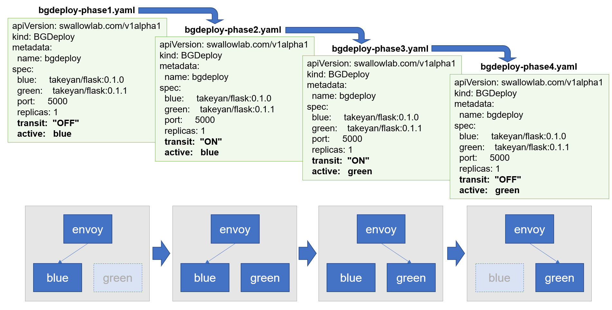

# bgdeploy-xds2

This project contains a prototype for "Blue Green Deployable" Custom Resource leveraging Operator SDK and Envoy's go-control-plane. 


## Verification Environment:
+ OS: Ubuntu 18.04.1 LTS (Bionic Beaver)
+ Golang: go1.15 linux/amd64
+ Operator SDK: v0.17.2
+ Docker: 19.03.12
+ k3s: v1.18.8+k3s1  

# How to get it run

## Prepare the verification environment

### 1. Install the prerequisites for the verification environment
Latest version is recommended except Operator SDK. 
This prototype depends on Operator SDK v0.17.2 specifically because this prototype uses templates generated with Operator SDK v0.17.2. 

### 2. Download this repository
```
git clone https://github.com/takeyan/bgdeploy-xds2.git
```

### 3. Build the operator 
```
cd bgdeploy-xds2
export OPERATOR_IMAGE={image name and tag for your container registry}
operator-sdk build $OPERATOR_IMAGE
docker login to your registry
docker push $OPERATOR_IMAGE
```

### 4. Edit the manifest file for the operator
```
vi deploy/operator.yaml (specify your image name and tag there)
```

### 5. Apply the manifest files
```
kubectl create -f deploy/service_account.yaml 
kubectl create -f deploy/role.yaml
kubectl create -f deploy/role_binding.yaml 
kubectl create -f deploy/crds/swallowlab.com_bgdeploys_crd.yaml
kubectl create -f envoy-configmap.yaml
```


## Run the verification scenario



### 1. Deploy the operator pod
```
kubectl create -f deploy/operator.yaml 
```

### 2. Deploy the BGDeploy custom resource with transit=OFF, target=blue
```
kubectl create -f bgdeploy_phase1.yaml
```

### 3. Memo the NodePort number of bgdeploy-svc-envoy (the number next to "10000:")
```
kubectl get svc

# kubectl get svc
NAME                    TYPE        CLUSTER-IP      EXTERNAL-IP   PORT(S)                           AGE
bgdeploy-svc-envoy      NodePort    10.43.206.226   <none>        10000:30764/TCP                   11s
```

### 4. Send a HTTP Get request to Envoy
```
curl localhost:{Envoy's NodePort number}/api/echo

# curl localhost:30764/api/echo
{"api":"echo","nodename":"tk-ub18-grpc2","pod_ip":"10.42.0.16","podname":"bgdeploy-dep-blue-68bb89dbf4-79lxf","query_string":[""],"timestamp":"2020-08-27T00:57:59.024066"}

You can see "blue" or "green" in the response message accordingly.
```

### 5. Switch the phase and see which application (blue or green) responds
```
kubectl apply -f bgdeploy_phase2.yaml
curl localhost:{Envoy's NodePort number}/api/echo

kubectl apply -f bgdeploy_phase3.yaml
curl localhost:{Envoy's NodePort number}/api/echo

kubectl apply -f bgdeploy_phase4.yaml
curl localhost:{Envoy's NodePort number}/api/echo
```

## Have fun!


